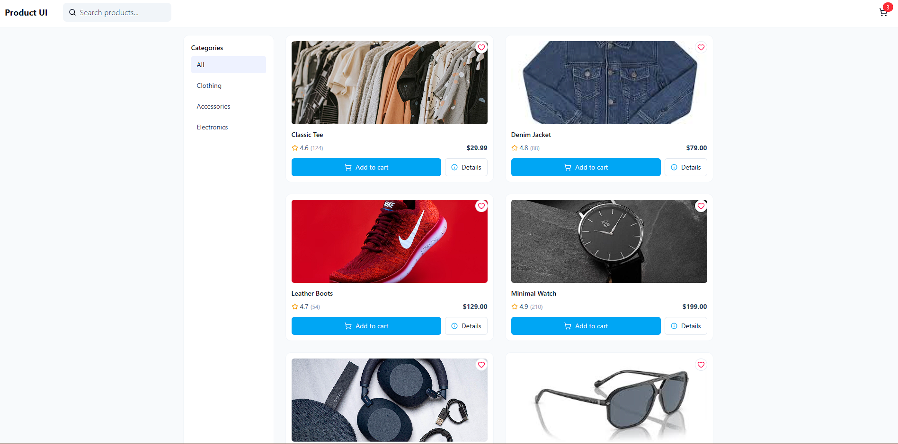

# Product List UI

A simple React product list UI built during the ITI React Day-1 lab. This project displays a list of products using cards and Tailwind CSS.

## Screenshot




## Live Demo

- Demo: link


## Run locally

1. Install dependencies:

```
npm install
```

2. Start dev server:

```
npm run dev
```

---


