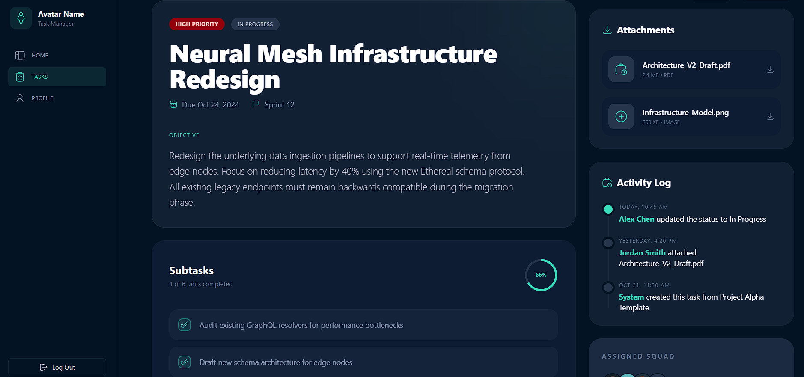
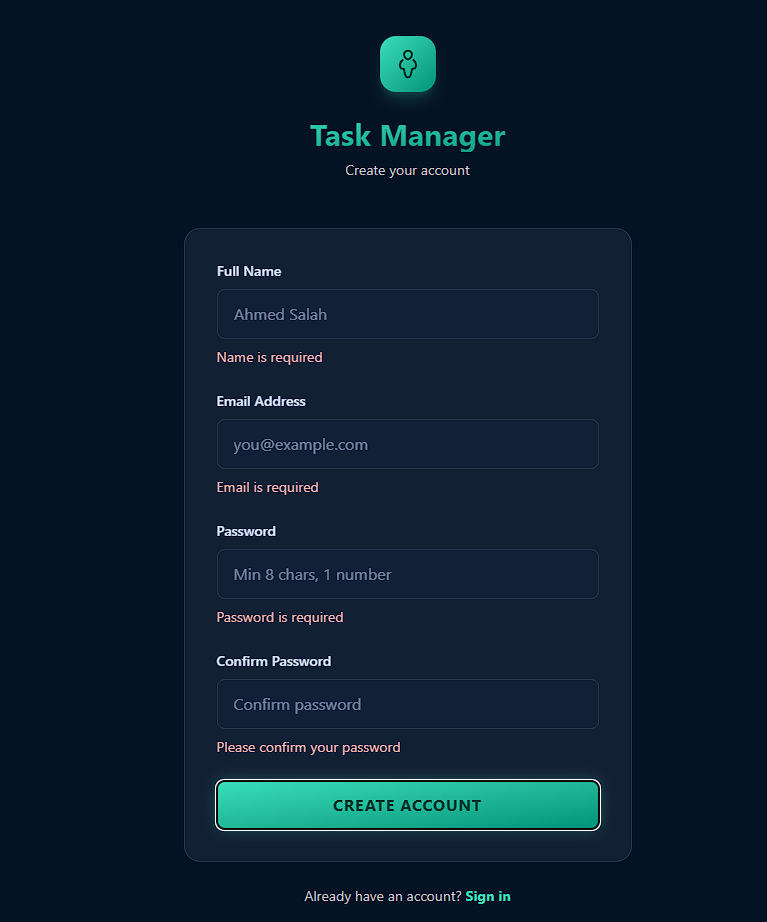

🎯 **Task Manager — Lab-React ITI**

A small, clean React + Vite task dashboard built during the ITI Lab.
> Note: This a scalable project will grow over time until ITI React course ends.


Live Demo
> https://iti-task-manager.vercel.app/


What you'll find
- ✅ Simple task list and detail views
- 🎨 Tailwind-based styling and responsive layout
- 📁 Clear component layout (components, pages, layouts)

Tech
- React 19 · Vite · Tailwind CSS · react-router-dom

Quick Start
1. Install deps:

```bash
npm install
```

2. Start dev server:

```bash
npm run dev
```

## Overview
A complete authentication system has been implemented that:
- Requires login/signup before accessing the app
- Redirects to home page (`/`) after successful login/signup
- Shows logged-in user's name in the sidebar
- Implements logout functionality
- Persists auth state in localStorage

## 🎯 How It Works

### Flow
1. **First Visit**: User is redirected to `/login` if not authenticated
2. **Login/Signup**: User fills in form and submits
3. **After Submit**: User is logged in and redirected to `/` (home page)
4. **In App**: User can navigate to Tasks, Profile, etc.
5. **In App**: User can navigate to Tasks can create new ones.
6. **In App**: User can navigate to Tasks can go to single task view.
7. **In App**: User can navigate to Tasks can change task status.
8. **In App**: User can navigate to Tasks can delete tasks.
5. **Logout**: Click "Log Out" button → redirects to `/login`

### Routes
- `/login` - Login page (public)
- `/signup` - Signup page (public)
- `/` - Home page (protected)
- `/tasks` - Tasks page (protected)
- `/profile` - Profile page (protected)
- `/tasks/:id` - Task details (protected)

## 📁 New Files Created

### Authentication Context
- **`src/context/AuthContext.jsx`**
  - Manages global auth state (user, login, signup, logout)
  - Persists auth data to localStorage
  - Provides `isAuthenticated` flag for route protection

### Form Components
- **`src/components/auth/LoginForm.jsx`**
  - Email & password fields
  - Redirects to home on success
  - Uses contact and custom hooks useAuth() -> login

- **`src/components/auth/SignupForm.jsx`**
  - Name, email, password, confirm password fields
  - Redirects to home on success
  - Uses contact and custom hooks useAuth() -> signUp

### Route Protection
- **`src/components/auth/ProtectedRoute.jsx`**
  - Wrapper for protected routes
  - Redirects to login if not authenticated

### Pages
- **`src/pages/Login.jsx`** - Login page wrapper
- **`src/pages/Signup.jsx`** - Signup page wrapper

## 🔄 Modified Files

### Core Updates
- **`src/App.jsx`**
  - Conditional routing based on authentication
  - Public routes (login/signup) when not authenticated
  - Protected routes (app) when authenticated
  - Automatic redirect to appropriate page based on auth status

- **`src/main.jsx`**
  - Added AuthProvider wrapper around entire app
  - Now: AuthProvider > TaskProvider > App

- **`src/components/common/Sidebar.jsx`**
  - Shows current user's name (from auth state)
  - Logout button now functional
  - Clears auth state and redirects to login

## 📦 Dependencies
- ✅ `formik` - Form state management
- ✅ `yup` - Form validation
- Already installed via previous setup

## 🧪 Testing

### Test Login
1. App starts → redirected to `/login`
2. Enter test credentials:
   - Email: `test@test.com`
   - Password: `Password123`
3. Click "Sign In" → redirected to home page `/`
4. Sidebar shows user name

### Test Signup
1. On login page, click "Sign up" → go to `/signup`
2. Fill form:
   - Name: `Ahmed`
   - Email: `ahmed@test.com`
   - Password: `SecurePass1`
   - Confirm Password: `SecurePass1`
3. Click "Sign Up" → redirected to home page `/`
4. Sidebar shows name "Ahmed"

### Test Logout
1. Click "Log Out" button in sidebar
2. Redirected to `/login`
3. Auth state cleared, must log in again

## 💾 Data Persistence

### localStorage Keys
- **`auth_user`** - Stores:
  ```json
  {
    "id": "uuid",
    "name": "User Name",
    "email": "user@example.com",
    "createdAt": "2026-04-10T..."
  }
  ```

### Page Refresh
- Auth state persists across page refreshes
- User remains logged in until logout or browser storage cleared
License
- Educational use — check with your instructor for redistribution rights.


Screenshots




